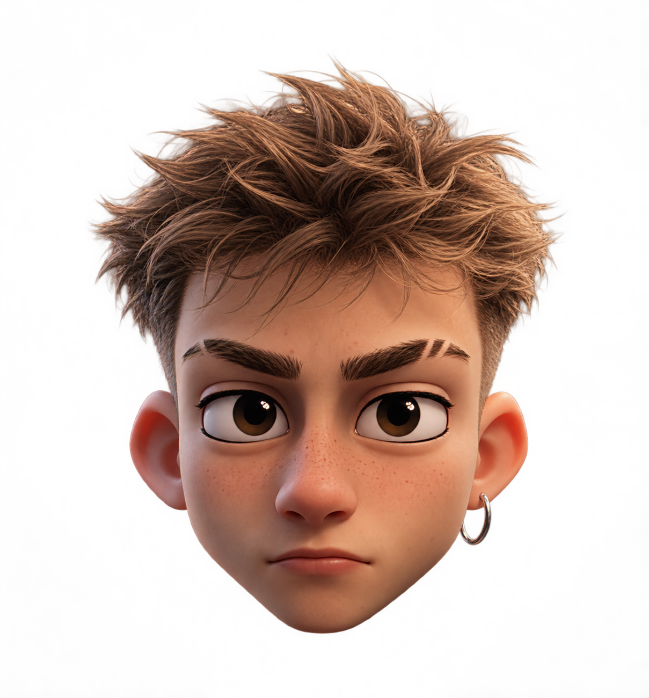

  

### 👋 About Me:

Hello, I am **Wexaro**. I enjoy creating websites and designs in the Minecraft space. ⛏️🧱

---

### 📬 Contact
- **Discord:** wexaro.dev
- **Email:** wexaro.dev@gmail.com

---

### 💻 Tech Stack & Skills

#### Programming Languages & Frontend

  

#### Frameworks & Platforms

  

#### Database & ORM Tools

  

#### DevOps & Cloud

  

#### 🎨 Design & Art

